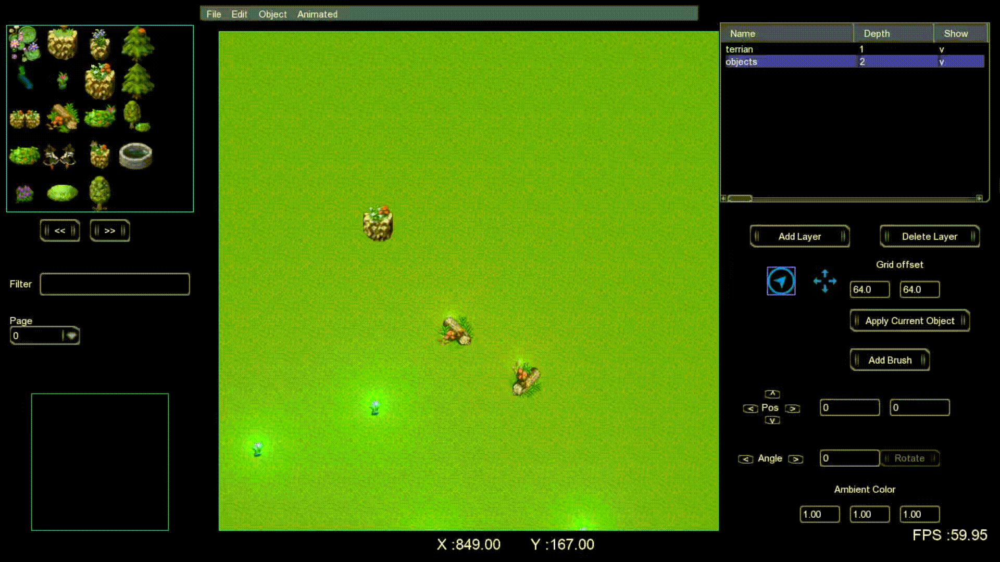
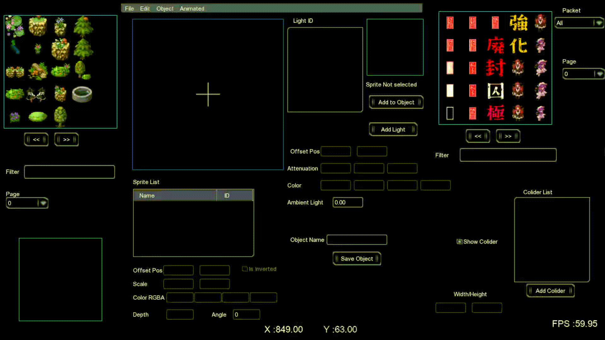
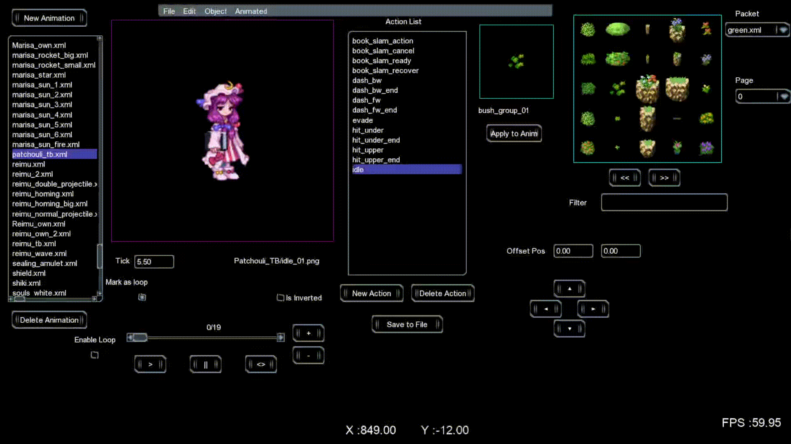
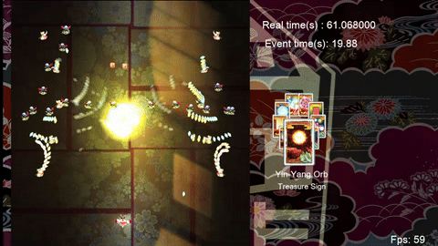
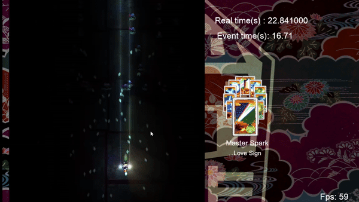
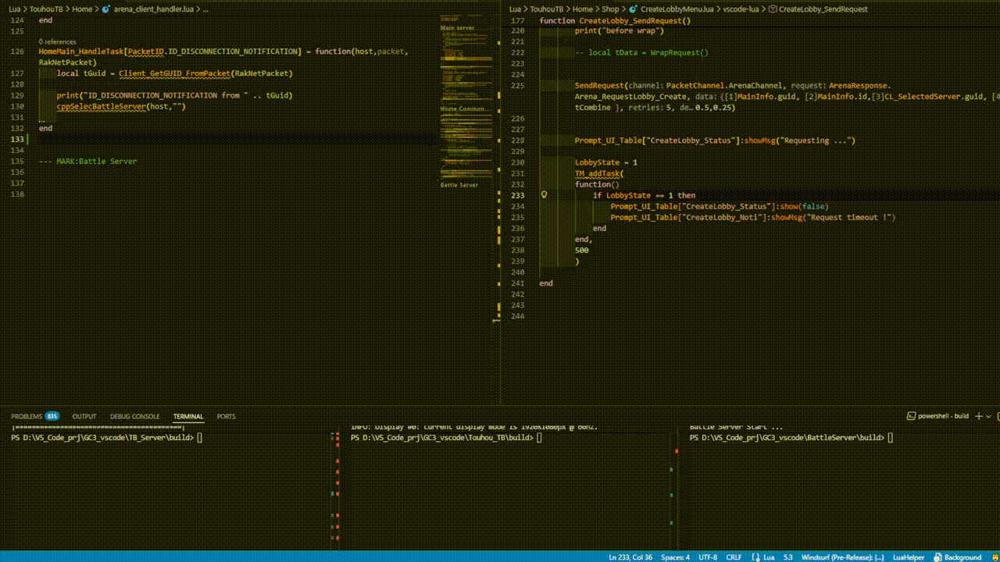

# My Game Development Projects

🚀 Welcome to my GitHub! Here, you'll find projects showcasing my expertise in **C++, game engines, networking, and tooling for game development.**

## 🔥 Projects Overview

### 🎮 Custom 2D Game Engine (C++, SDL2, OpenGL, Lua, Protobuf, CEGUI, TGUI)
- Built from using SDL2, OpenGL to support **2D games** with real-time rendering and physics.
- Features a **Lua scripting system** for game logic.

### 🛠 Game Editor (Built using my engine)
- **2D Top-down Map Builder**: Create RPG-style maps with **custom objects and lighting**.
  
  
- **Sprite Animation Editor**: Design and preview **frame-based animations**.
  
- **Arc Calculator**: Useful for **Touhou-like projectile patterns**.
- **Enemy/Boss Editor**: Customize enemy behaviors and attack patterns.

### 🔥 Touhou-like Game (Built using my engine)
- **All core gameplay systems are implemented**, including movement, projectiles, and spell cards.
  
  
- **Content is still in development**.

### ⚔ Turn-Based Multiplayer Game (Prototype) (C++, RakNet, SQLite3)
- **Login & Account System** ✅
- **Basic movement, skills, animations, and hit calculations** (not yet fully playable).


### 🌐 Multiplayer Game Server (C++, RakNet, SQLite3, mbedTLS)
- **Manages player accounts** with secure login/register.
- **Encrypts & decrypts messages** between client and server using **mbedTLS** for security.

## Online features:
- **Connect to server**
- **Request keys(for register account)**
- **Login/Register Account**
- **Request data from server(such as currency,info)**
- **Client progress**
  
---

## 🛠 Tech Stack & Tools
- **Languages**: C++, Lua, SQL
- **Libraries/API**: SDL2, OpenGL, RakNet, Protobuf,CEGUI, TGUI
- **Networking & Security**: **mbedTLS** (for message encryption/decryption)
- **Tools**: Visual Studio Code, MinGW-w32
- **Database**: SQLite3

---

## ⚙ Build Instructions
### **Prerequisites**
- Install **CMake** .
- Install **MinGW-w32** (https://gnutoolchains.com/mingw32/) Please select this specific compiler or it won't work. 

### **Building the Project (Use Powershell)**
```sh
# Clone the repository
git clone https://github.com/feint1980/GC3_vscode.git
cd GC_vscode

#Build the engine (you must build this first to build other application) 
cd Feintgine/build/
cmake -G "MinGW Makefiles" ..
mingw32-make.exe -j 4

#Build the Editor 
cd ../../
cd Editor/build/
cmake -G "MinGW Makefiles" ..
mingw32-make.exe -j 4

#Build the Touhou game
cd ../../
cd GC3/build/
cmake -G "MinGW Makefiles" ..
mingw32-make.exe -j 4


#Build the Server for turnbase game ( you will need this for login)
cd ../../
cd TB_Server/build/
cmake -G "MinGW Makefiles" ..
mingw32-make.exe -j 4

#Build the Battle Server for the turnbase game ( you will need this to create the lobbies)
cd ../../
cd BattleServer/build/
cmake -G "MinGW Makefiles" ..
mingw32-make.exe -j 4

#Build the Touhou turnbase game
cd ../../
cd Touhou_TB/build/
cmake -G "MinGW Makefiles" ..
mingw32-make.exe -j 4


```
## Accounts(for test):
>account #1
>id:huyen12
>pw:12345678

>account #2
>id:huyen13
>pw:12345678

for register keys:
-32X6K7VHLVZW
-ELOGAKEOEEOJ
-O78O47VUJXAK
-A68692YDCT3K
or you can check the data dump located in "TB_Server\data\dumpvs.sql"
## Note
For the Editor and Game that you want to see but don't have time to build : 

[](https://www.youtube.com/watch?v=HkZZ71s609o)

## 📋 Server progress

🟩 DONE ✅
- [x] Login
- [x] Key request
- [x] Account registration with key
- [x] Main menu data request (Mon, Souls)
- [x] Character shop UI
- [x] Server returns character list
- [x] Basic packet communication system
- [x] SQLite character data load (server side)
- [x] Shop character purchase UI
- [x] Purchase character & save to player ownership
- [x] Retrieve owned characters on login
- [x] Team loadout screen 
- [x] Equip/load team before match
- [x] Create Battle Servers
- [x] Error messages for failed server responses
- [x] Handle the Main Server with Battle Servers
- [x] Server battle room/session manager
🟨 IN PROGRESS 	🚧 
- [x] Battle prototype (2-character dummy test) 🚧🚧🚧🚧🚧
- [x] Turn bar system and turn queue logic 🚧🚧🚧🚧
- [x] Skill use / targeting / resolution system 🚧
- [x] Hit/miss, crit, dodge, and damage formulas 🚧🚧
- [x] Server-side validation of all combat logic 🚧🚧🚧
🟥 TO DO
- [ ] Battle matchmaking or challenge system
- [ ] Buffs/Debuffs & status effect system
- [ ] Character death, win/loss condition logic
- [ ] Reward distribution post-match
- [ ] Match replay or battle log system
- [ ] Handle disconnects / timeouts / AFK
- [ ] Leveling system for characters
- [ ] Save/load character XP & level
- [ ] Equip system
- [ ] Daily reward or login streak logic
- [ ] Gacha or random draw system (IDK bro, may be)
- [ ] Room teardown after battle ends
- [ ] Simple server monitoring / auto-restart script
- [ ] Server-side turn timer
- [ ] Basic in-game debug tools (log, packet view)
- [ ] Player profile (nickname/avatar)
- [ ] Change password or account options (optional)

## Icon for me : 
⏳ 🧪 🔧 🧠 🚧 📦 📋 📝
